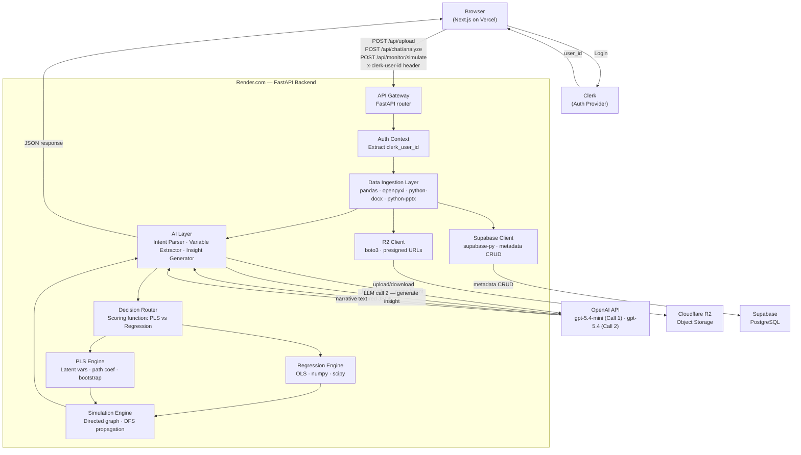

# SOTA StatWorks — System Design

| Field           | Value                               |
|-----------------|-------------------------------------|
| **Status**      | `draft`                             |
| **Team**        | Phú Nhuận Builder x SOTA Works      |
| **Project**     | SOTA StatWorks                      |
| **Created**     | 2026-03-20                          |
| **Last updated**| 2026-03-21                          |
| **PRD**         | `.docs/01-prd.md`                   |

---

## 1. Mission

SOTA StatWorks is an AI-powered decision engine that accepts raw tabular data and natural-language questions, runs statistical modeling (OLS regression or PLS-SEM), and returns ranked insight plus interactive scenario simulation — all without requiring the user to understand statistics.

It serves business analysts, product managers, marketers, and students who need decisions, not coefficient tables. It exists because no current tool bridges natural-language querying, real statistical computation, and what-if simulation in a single, accessible interface.

---

## 2. Design Principles

| Principle | Why it matters for this system |
|---|---|
| **Decisions over data** | Every API response must terminate in a human-readable recommendation. Returning raw numbers without interpretation is a failure mode. |
| **Stateful-lite by default** | In-memory state serves as a fast cache layer. Persistent metadata lives in Supabase; raw files live in Cloudflare R2. Users can reload or return and resume their session without re-uploading. See ADR-0002, ADR-0003. |
| **Fail gracefully, never crash** | Free-tier LLMs produce malformed output unpredictably. The system must always return a valid response — degraded if necessary — via a layered fallback chain. |
| **Latency budget is a hard constraint** | The PRD sets < 2s for `/analyze`. Every design decision (bootstrap cap, token cap, in-process computation) must be evaluated against this budget first. |
| **LLM is an orchestrator, not the brain** | LLM handles parsing and narrative. Statistical truth comes from deterministic code (`numpy`, `scipy`). This separation prevents hallucination from corrupting quantitative output. |
| **Decouple identity from computation** | Auth (Clerk) handles login and user identity only. It never touches the statistical engine or LLM layer. The backend extracts `clerk_user_id` from request headers — no Clerk SDK needed server-side. See ADR-0001. |

---

## 3. Tech Stack

| Layer | Technology | Notes |
|---|---|---|
| **API framework** | FastAPI (Python 3.11+) | Async support; automatic OpenAPI docs useful for FE integration |
| **Statistical core** | `numpy`, `scipy`, `pandas` | OLS via `numpy` matrix ops; bootstrapping via `numpy.random`; PLS latent variable computation via `pandas` aggregation |
| **PLS extension** | `pyplspm` (optional) | Used only if custom PLS implementation proves unstable; adds dependency weight |
| **File parsing — Excel/CSV** | `pandas`, `openpyxl` | `pandas.read_excel` / `read_csv` as primary; `openpyxl` as engine |
| **File parsing — Word** | `python-docx` | Text extraction only; no formatting preserved |
| **File parsing — PowerPoint** | `python-pptx` | Text extraction from slide content; no media |
| **AI / LLM — Call 1 (parsing)** | OpenAI API · `gpt-5.4-mini` | Intent classification + variable extraction; JSON mode + function calling; 400K context window; $0.75/1M input, $4.50/1M output — ~$0.00075/request at ≤1k tokens |
| **AI / LLM — Call 2 (insight)** | OpenAI API · `gpt-5.4` | Business-language narrative generation; 272K standard context (1.05M extended); $2.50/1M input, $15.00/1M output — ~$0.0025/request; highest prose quality for judge impression |
| **Frontend framework** | Next.js 14 (App Router) + TypeScript | Deployed to Vercel via Git push (no Vercel CLI) |
| **Styling** | TailwindCSS | Utility-first; consistent with the single-screen layout constraint |
| **UI components** | Shadcn/UI | Accessible primitives; avoids building from scratch under time pressure |
| **Charts** | Recharts | Horizontal bar chart for driver ranking; lightweight, React-native |
| **Animation** | Framer Motion | Count-up numbers, fade-in panels, bar grow — core to the wow factor |
| **Client state** | Zustand | Minimal global store: `dataset`, `insight`, `simulation` |
| **Server state** | TanStack Query (React Query) | Handles loading / error / refetch lifecycle for `/analyze` and `/simulate` |
| **File upload (FE)** | `react-dropzone` | Drag-and-drop zone on the landing state |
| **Backend hosting** | Render.com (free tier) | Web Service; Python; cold-start latency ~30s (acceptable if pre-warmed before demo) |
| **Frontend hosting** | Vercel (hobby tier) | Deployed via GitHub push; no Vercel CLI required |
| **Async queue (optional)** | Celery + Redis | Only added if bootstrap > 200 samples is needed and blocks the 2s budget |
| **Authentication** | Clerk | OAuth provider (Google login); prebuilt UI components; session management offloaded from backend. Free tier: 10K MAU. See ADR-0001 |
| **Metadata DB** | Supabase (PostgreSQL) | Managed Postgres; `supabase-py` for backend; RLS-capable; JSONB for analysis results. Free tier: 500 MB. See ADR-0002 |
| **Object storage** | Cloudflare R2 | S3-compatible; zero egress fees; `boto3` SDK; presigned URL upload/download. Free tier: 10 GB. See ADR-0003 |

---

## 4. Architecture

### 4.1 High-Level Diagram



### 4.2 Request Lifecycle — `/analyze`

```
POST /analyze  { query: string, file_id: string }
│
├─ 1. Retrieve parsed dataset: check in-memory cache first, then fetch from R2 via Supabase metadata
├─ 2. AI Layer — LLM call 1: intent + variable extraction
│      • system prompt: strict JSON schema
│      • user prompt: column names + query
│      → { intent, target, features }
│
├─ 3. Validation Layer
│      • strip features not in DataFrame columns
│      • auto-detect target if missing (last column / columns matching "index", "score")
│      • fallback: top N numeric columns as features
│
├─ 4. Decision Router
│      • compute score_pls = 0.4·L + 0.3·M + 0.3·C
│      • compute score_reg = 0.6·O + 0.4·(1−C)
│      • select engine
│
├─ 5. Statistical Engine (Regression or PLS)
│      • OLS: β = (XᵀX)⁻¹Xᵀy  →  R², p-values via bootstrap (≤200 samples)
│      • PLS: LV = mean(indicators) → path coef → bootstrap
│
├─ 6. AI Layer — LLM call 2: insight generation
│      • input: { drivers, r2, model_type }
│      • output: { summary, recommendation }
│
└─ 7. Return response
       { summary, drivers[{name, coef, p}], r2, recommendation, model_type }
       → Persist analysis result to Supabase (async, non-blocking)
```

### 4.3 Request Lifecycle — `/simulate`

```
POST /simulate  { variable: string, delta: float, file_id: string }
│
├─ 1. Load cached path coefficients from in-memory store
├─ 2. Build directed graph from coefficient map
│      graph = { "Trust": [("Retention", 0.62)], ... }
├─ 3. DFS propagation
│      ΔY = β · ΔX            (1-hop)
│      ΔZ = β_XZ·ΔX + β_YZ·(β_XY·ΔX)   (multi-hop)
└─ 4. Return { impacts: [{ variable, delta_pct }] }
```

### 4.4 Component Responsibilities

| Component | Owns | Exposes | Depends on |
|---|---|---|---|
| **API Gateway** | Routing, request validation (Pydantic), CORS | HTTP endpoints under `/api/*`: `/api/upload`, `/api/chat/analyze`, `/api/monitor/simulate`, `/api/data/*`, `/api/history/*`, `/api/auth/*`, `/api/health` | All internal components |
| **Data Ingestion Layer** | File parsing, column type detection, in-memory DataFrame store | `DataFrame`, `file_id`, column metadata | `pandas`, `openpyxl`, `python-docx`, `python-pptx` |
| **AI Layer** | Prompt construction, LLM call management, retry logic, insight template | `ParsedIntent`, `InsightText` | OpenRouter API |
| **Validation Layer** | Schema enforcement on LLM output, fallback variable selection | Cleaned `ParsedIntent` | `DataFrame` column list |
| **Decision Router** | Model scoring, engine selection, decision trace logging | Engine choice (`regression` / `pls`) | None |
| **Regression Engine** | OLS computation, bootstrap, p-value estimation | `DriverResult[]`, `R²` | `numpy`, `scipy` |
| **PLS Engine** | Latent variable scoring, inner model path coefficients, bootstrap | `DriverResult[]`, `R²` | `numpy`, `pandas` |
| **Simulation Engine** | Graph construction, DFS impact propagation | `SimulationResult` | Coefficient map from stat engine |

### 4.5 Frontend Component Tree

```
<AppLayout>
  <Sidebar>                — vertical left nav (68px collapsed, 180px expanded), light background with blue gradient, shadow divider
    <SidebarItem: Upload>   — ➕ icon, always active, path: /app
    <SidebarItem: AI Chat>  — 🗨️ icon, gated until first upload, path: /app/chat
    <SidebarItem: DataViewer> — 📊 icon, gated until first upload, path: /app/viewer
    <SidebarItem: Monitor>   — 📈 icon, gated until first upload, path: /app/monitor
    <SidebarItem: History>    — 📋 icon, always active, path: /app/history
    <SidebarSpacer>
    <SidebarItem: Account>  — user initials, always active
  <ContentArea>             — renders active view based on URL [[...slug]] catch-all route
    <UploadView>            — <UploadZone> <UploadHistory>               (/app)
    <ChatView>              — <ChatPanel> <InsightPanel> <SimulationBar> (/app/chat)
    <DataViewerView>        — <FileTabs> <FileContentEditor>             (/app/viewer)
    <MonitorView>           — <MonitorTabs: Data Analysis | Impact Analysis> <RibbonMenu> <ResultArea> (/app/monitor, /app/monitor/data-analysis, /app/monitor/impact-analysis)
    <HistoryView>           — <HistoryTabs: AI Chat | Data Edits | Monitor> (/app/history/chat, /app/history/viewer, /app/history/monitor)
```

---

## 5. External Dependencies

| Service | Purpose | Failure behavior |
|---|---|---|
| **OpenAI API (`gpt-5.4-mini`)** | LLM Call 1: intent classification and variable extraction (JSON mode + function calling); released March 17, 2026; 400K context window | Retry ×2 with 500ms backoff → if still failing, fallback: auto-detect features, template-generated summary string |
| **OpenAI API (`gpt-5.4`)** | LLM Call 2: business-language insight and recommendation generation; released March 5, 2026; up to 1.05M context; frontier reasoning model | Retry ×2 with 500ms backoff → if still failing, use template: `"{top_driver} shows the strongest relationship with {target} (β={coef:.2f})."` |
| **Clerk** | Authentication (Google OAuth), session management, user identity | Clerk is external; if unreachable, frontend shows "Login unavailable" message. Backend can still function without auth for anonymous demo mode. |
| **Supabase** | PostgreSQL metadata persistence (users, datasets, analyses) | If unreachable, backend falls back to in-memory-only mode (stateless, no persistence). Analysis still works; data is not persisted. |
| **Cloudflare R2** | Object storage for dataset files and analysis output | If unreachable, backend falls back to in-memory-only storage. Upload still works locally; data is not persisted to R2. |
| **Render.com (free tier)** | Backend hosting | Cold start ~30s after inactivity; pre-warm by hitting `/health` before demo. Free tier has 512 MB RAM — keep DataFrame in-memory, not persisted |
| **Vercel (hobby tier)** | Frontend hosting | Deployed automatically on push to `main` branch; no CLI required. Serverless functions not used (all compute is on Render backend) |

---

## 6. Cross-Cutting Concerns

### 6.1 Security

**Authentication — Clerk:**
- Users authenticate via Clerk (Google OAuth). The frontend wraps the app with `<ClerkProvider>` and uses `useUser()` to get the current user.
- All API requests from the frontend include the `x-clerk-user-id` header extracted from the Clerk session.
- The backend extracts `clerk_user_id` from the request header in `auth/context.py`. No Clerk SDK is used on the backend.
- `CLERK_SECRET_KEY` is stored as an environment variable on Render (if JWT verification is needed). `NEXT_PUBLIC_CLERK_PUBLISHABLE_KEY` is set in Vercel.

**Data access:**
- Supabase Row Level Security (RLS) can restrict users to access only their own datasets and analyses. For v1 demo, RLS is optional but recommended.
- Cloudflare R2 buckets are private. All access is via time-limited presigned URLs generated by the backend. No public bucket access.

**API keys:**
- OpenAI API keys (`OPENAI_API_KEY_1` through `OPENAI_API_KEY_4`) are stored as environment variables. Must not be committed to source control.
- Supabase keys (`SUPABASE_URL`, `SUPABASE_SERVICE_KEY`) are stored as environment variables on Render.
- R2 keys (`R2_ACCOUNT_ID`, `R2_ACCESS_KEY_ID`, `R2_SECRET_ACCESS_KEY`, `R2_BUCKET_NAME`) are stored as environment variables on Render.

**Controls in place:**
- CORS restricted to the Vercel frontend origin (configured in FastAPI middleware).
- Pydantic models enforce request shape — malformed JSON is rejected at the boundary.
- LLM output is always passed through the Validation Layer before touching statistical computation; raw LLM text never reaches `numpy` directly.

### 6.2 Data Architecture

**Three-layer storage model:**

| Layer | Technology | Purpose |
|---|---|---|
| **In-memory cache** | Python `OrderedDict` | Fast access to the latest dataset DataFrame and coefficient cache. LRU eviction at 10 entries. |
| **Metadata store** | Supabase (PostgreSQL) | Persistent metadata: user records, dataset references, analysis results (JSONB). Survives process restarts. |
| **Object store** | Cloudflare R2 | Raw dataset files (.csv, .xlsx) and analysis output (.json). Accessed via presigned URLs. |

**Supabase tables:**

| Table | Columns | Purpose |
|---|---|---|
| `users` | `id uuid`, `clerk_user_id text`, `email text`, `name text` | Identity mapping (Clerk ↔ DB) |
| `datasets` | `id uuid`, `user_id uuid`, `file_name text`, `r2_key text`, `created_at timestamp` | Dataset metadata |
| `analyses` | `id uuid`, `dataset_id uuid`, `result jsonb`, `created_at timestamp` | Analysis result persistence |

**R2 bucket structure:**

```
bucket/
  users/
    {clerk_user_id}/
      datasets/
        {dataset_id}.csv
      outputs/
        {analysis_id}.json
```

**Lifecycle:**
- Upload: Frontend requests presigned URL from backend → uploads file directly to R2 → backend stores metadata in Supabase → caches DataFrame in memory.
- Analyze: Backend checks in-memory cache first. If not cached, fetches file from R2, parses it, caches it. Runs analysis. Stores result in Supabase.
- Simulate: Reads coefficient cache from memory (stored by `/analyze`). No R2 or Supabase access needed.
- Context files (`.docx`, `.pptx`): Text is extracted at upload time and appended to the LLM prompt as plain string context. Also stored in Supabase as part of dataset metadata.

### 6.3 Performance and Scalability

| Target | Mechanism |
|---|---|
| `/analyze` < 2s end-to-end | Bootstrap capped at 200 samples; LLM token budget ≤ 1k per call; in-process computation (no subprocess or queue overhead) |
| `/simulate` < 1s | Operates on cached coefficients; DFS on small graph (< 20 nodes); no LLM call |
| Render cold-start mitigation | Pre-warm by hitting `GET /health` before demo begins |
| Single concurrent user | Stateless design; in-memory dict is not thread-safe for concurrent writes. Acceptable for hackathon; production would need per-request state isolation |

**Hard limits (v1):**
- Maximum file size: 20 MB (enforced in `POST /upload`)
- Maximum files per upload: 5
- Maximum bootstrap samples: 200
- Maximum LLM tokens per request: 1000 (system + user prompt combined)
- Maximum features surfaced in response: 5 (top N by absolute coefficient)

### 6.4 Error Handling and Resilience

The system uses a layered fallback chain, ensuring it never returns an empty response:

```
Layer 1 — LLM parse fails (malformed JSON or timeout)
  → Fallback: auto-select all numeric columns as features,
    detect target as last column or column matching "score"/"index"

Layer 2 — PLS engine fails (e.g. insufficient rows, singular matrix)
  → Fallback: always run OLS regression

Layer 3 — Regression engine fails (all-NaN column, zero variance)
  → Fallback: return { summary: "Insufficient data for analysis",
    drivers: [], r2: null, recommendation: "Please check your dataset." }

Layer 4 — LLM insight generation fails (Call 2)
  → Fallback: template-generated string:
    "{top_driver} shows the strongest relationship with {target} (β={coef:.2f})."
```

LLM calls use retry ×2 with 500ms backoff before triggering Layer 1 fallback.

---

## 7. Constraints

| Constraint | Architectural impact |
|---|---|
| **Backend on Render.com free tier** | 512 MB RAM ceiling → no large matrix ops; no persistent disk; cold-start requires pre-warming |
| **Frontend on Vercel, no CLI** | Deployment exclusively via `git push` to `main`; no server-side compute on Vercel; all API calls proxied to Render |
| **Persistence layer** | Supabase for metadata, Cloudflare R2 for files. In-memory store is cache-only. Fallback to in-memory-only mode if external services are unreachable. |
| **Free LLM (OpenRouter)** | Rate limits apply; structured output is not guaranteed; validation layer and fallback chain are load-bearing |
| **≤ 2 LLM calls per `/analyze` request** | Prohibits chain-of-thought or multi-step reasoning via LLM; all branching logic must live in deterministic Python code |
| **< 2s response for `/analyze`** | Bootstrap ≤ 200 samples; no async queue for v1; no heavy pre-processing |
| **20–30h build window** | Scope is fixed; optional features (Celery, full PLS, PDF export) are not built unless core is complete and time remains |

---

## 8. Architecture Rationale

**Why FastAPI over Flask or Django?**
FastAPI's async support, automatic Pydantic validation, and built-in OpenAPI documentation reduce integration friction with the frontend significantly, especially under time pressure.

**Why in-memory state over a lightweight DB (SQLite, Redis)?**
Render's free tier does not include a managed database. SQLite on a free web service loses data on restart; adding Redis adds a separate paid service. For a single-session demo, an in-process dict is the correct tradeoff.

**Why OpenAI API (`gpt-5.4-mini` + `gpt-5.4`) instead of OpenRouter?**
The hackathon organiser sponsors $100 per account across 4 accounts ($400 total). This removes cost as a design constraint entirely. `gpt-5.4-mini` (released March 17, 2026) is used for Call 1 (intent parsing): it has a 400K context window, supports native JSON mode and function calling, and runs more than 2× faster than its predecessor — critical for the < 2s latency budget. `gpt-5.4` (released March 5, 2026) is used for Call 2 (insight generation): it is OpenAI's current frontier model with up to 1.05M context and significantly better prose quality, which directly improves the recommendation text judges read. At ≤1k tokens/request the total API cost per `/analyze` call is ~$0.003 — even 10,000 test runs = $30, well within the $400 budget.

**Why OLS + PLS-SEM instead of a single approach?**
SPSS-style OLS is universally understood and fast. PLS-SEM handles latent variables and is used in academic business research (the primary demo audience). Auto-selection removes the burden from the user — which is the core product differentiator.

**Why Vercel for frontend with no CLI?**
Vercel's GitHub integration is zero-configuration. Connecting the repo and pushing to `main` is the entire deployment workflow. The Vercel CLI adds no value here and introduces a setup step that can fail during a hackathon.

**Why Clerk for authentication?**
Clerk provides prebuilt UI components, native Google OAuth, and session management that offloads all auth logic from the backend. For a 20–30h build window, it saves 3–4 hours compared to rolling custom auth. See ADR-0001 for full rationale and alternatives.

**Why Supabase for metadata?**
Render's ephemeral filesystem prevents SQLite from persisting data. Supabase provides a managed PostgreSQL instance with a generous free tier (500 MB), a Python SDK, and JSONB for storing analysis results. See ADR-0002.

**Why Cloudflare R2 for object storage?**
Zero egress fees, S3-compatible API (uses `boto3`), and 10 GB free storage. Superior to S3 for a product that repeatedly downloads datasets for reanalysis. See ADR-0003.

---

## 9. Open Points

| # | Question | Context | Options |
|---|---|---|---|
| OA-1 | Thread-safety of the in-memory `file_id` store | Python `dict` writes are not atomic under concurrent requests in multi-worker Uvicorn | (a) Accept single-worker limitation for demo; (b) Use `threading.Lock`; (c) Use `asyncio.Lock` |
| OA-2 | Render cold-start mitigation strategy | Free tier spins down after 15min inactivity; ~30s cold start would break the demo | (a) Pre-warm manually; (b) Use UptimeRobot ping every 14min (free); (c) Upgrade to paid |
| OA-3 | CORS origin configuration | Frontend URL is only known after first Vercel deploy | Set to `*` during development; update to exact Vercel URL before demo |
| OA-4 | `pyplspm` dependency stability | Library has limited maintenance; may conflict with `scipy` version | (a) Use only if custom PLS fails; (b) Implement minimal PLS from scratch with `numpy` |
| OA-5 | Maximum concurrent file uploads | In-memory dict grows unbounded if many files are uploaded | (a) Cap at 10 entries with LRU eviction; (b) Accept unbounded growth for demo only |
| OA-6 | Which OpenAI account key to use as primary | 4 keys available; rate limits are per-key | (a) Designate one key as primary, others as fallback rotation; (b) Round-robin across all 4 |

---

## 10. Related Documents

| Document | Path | Status |
|---|---|---|
| **Product Requirements** | `.docs/01-prd.md` | `draft` |
| **Codebase Summary** | `.docs/03-codebase-summary.md` | Not yet created |
| **Feature Specs** | `.docs/03-features-spec.md` | `draft` |
| **ADR-0001** | `.docs/more/adrs/0001-clerk-authentication.md` | `proposed` |
| **ADR-0002** | `.docs/more/adrs/0002-supabase-metadata.md` | `proposed` |
| **ADR-0003** | `.docs/more/adrs/0003-cloudflare-r2-storage.md` | `proposed` |
| **ADR-0004** | `.docs/more/adrs/0004-canva-sidebar-navigation.md` | `proposed` |
| **ADR-0005** | `.docs/more/adrs/0005-chat-history-persistence.md` | `proposed` |

---

## 11. Updated Architecture Summary

```text
[Frontend]
Next.js + Clerk (@clerk/nextjs)
    ↓
[Auth]
Clerk (Google OAuth, session management)
    ↓
[Backend]
FastAPI (statistical engine + AI + orchestration)
    ↓
[Storage Layer]
- Supabase (PostgreSQL — metadata: users, datasets, analyses)
- Cloudflare R2 (object storage — raw files, presigned URLs)
- In-memory cache (fast access to latest DataFrame + coefficients)
```

### System Boundary Summary

| Component | Handles | Does NOT handle |
|---|---|---|
| **Clerk** | Login, user identity, session tokens | Data, analysis, storage |
| **Supabase** | User records, dataset metadata, analysis results | Raw files, computation |
| **Cloudflare R2** | Raw dataset files, analysis output files | Metadata, identity, computation |
| **FastAPI Backend** | Statistical computation, LLM orchestration, API routing | Auth UI, file hosting |
| **In-memory cache** | Fast DataFrame access, coefficient cache | Persistence (cache-only) |
