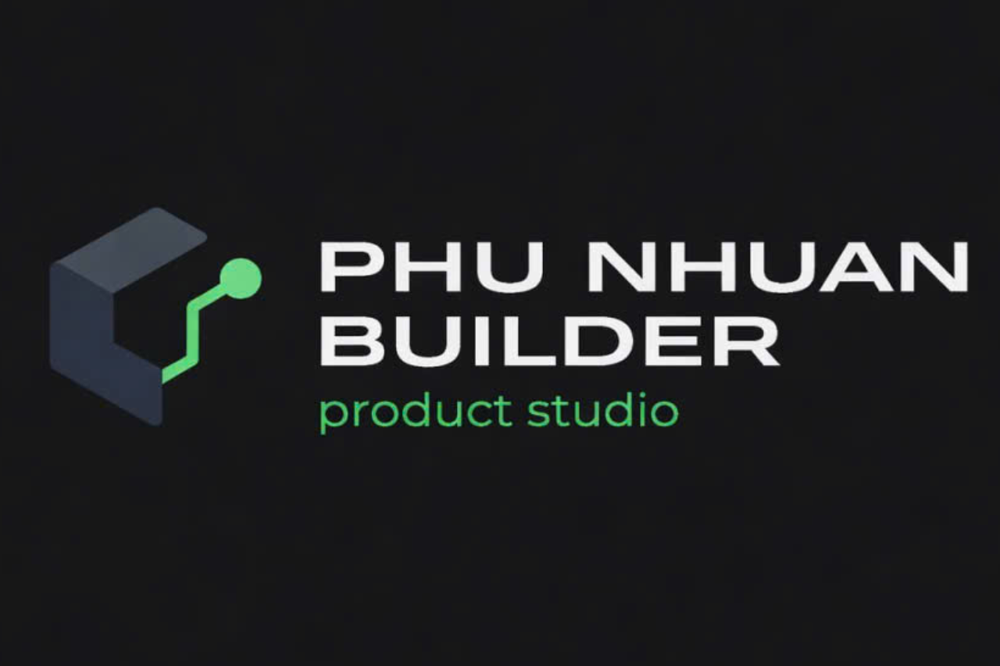
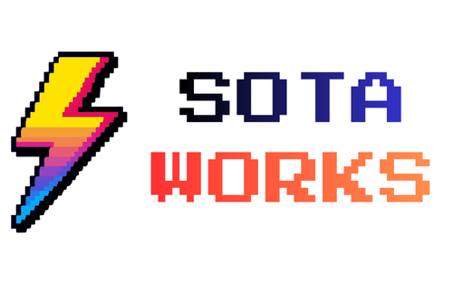

<div align="center">


### From Data to Decisions, Instantly

**AI-powered statistical decision engine** that turns raw data into ranked insights and what-if simulations — without statistical expertise.

[](LICENSE)
[](https://lotushack.org)
[]()

---

&nbsp;&nbsp;&nbsp;&nbsp;&nbsp;&nbsp;

**Phú Nhuận Builder × SOTA Works**

</div>

---

## 🧩 The Problem

Current data analysis tools weren't built for decision-makers — they were built for statisticians.

- **SPSS** requires training, expensive licenses, and manual interpretation
- **SmartPLS** demands SEM modeling expertise most teams don't have
- **Excel** can chart data but can't tell you *what drives your outcomes*
- **ChatGPT** can discuss statistics but can't run real models on your data

**The gap:** Business leaders need answers, not p-values. They need to know *"What should I focus on?"*, not *"What is the beta coefficient of X?"*

## 💡 The Solution

**SOTA StatWorks** — one screen, one question, one decision.

Upload a dataset (CSV or Excel), ask a natural-language question like *"What affects customer retention?"*, and get:

1. **AI-parsed intent** — GPT-5.4-mini identifies which variables you're asking about
2. **Automated statistical analysis** — Decision Router selects the optimal engine (OLS or PLS-SEM)
3. **Executive summary** — GPT-5.4 translates results into jargon-free business language
4. **Driver ranking chart** — Visual ranking of key drivers with impact strength
5. **What-if simulation** — Adjust any driver by ±50% and instantly see predicted impact

No statistical knowledge required. No manual model configuration. No jargon.

## ✨ What Makes Us Different

| Feature | SPSS | SmartPLS | ChatGPT | **SOTA StatWorks** |
|---------|------|----------|---------|-------------------|
| Natural language questions | ❌ | ❌ | ✅ | ✅ |
| Real statistical engines | ✅ | ✅ | ❌ | ✅ |
| Auto model selection | ❌ | ❌ | ❌ | ✅ |
| Jargon-free insights | ❌ | ❌ | ~  | ✅ |
| What-if simulation | ❌ | ❌ | ❌ | ✅ |
| No training needed | ❌ | ❌ | ✅ | ✅ |
| Free & open source | ❌ | ❌ | ❌ | ✅ |

---

## 🚀 Features

### 📤 Smart Upload
- Drag-and-drop or click to upload `.csv` / `.xlsx` datasets
- Optional context files (`.docx`, `.pptx`) for richer AI understanding
- Auto-detects column types, strips whitespace, validates data quality
- Persists to Cloudflare R2 + Supabase for authenticated users

### 🤖 AI-Powered Analysis
- **2-call LLM pipeline**: Intent parsing (GPT-5.4-mini) → Insight generation (GPT-5.4)
- **Decision Router**: Automatically selects OLS Regression or PLS-SEM based on dataset structure
- **4-layer fallback chain**: System never crashes — gracefully degrades at every step
- **Jargon ban**: AI is instructed to never use statistical terminology

### 📊 Driver Ranking
- Horizontal bar chart with proper axes, tick marks, and grid lines
- Color-coded: green (positive impact) / red (negative impact)
- Tooltip with detailed impact value, p-value, and significance
- Sorted by absolute impact strength (strongest first)

### 🔮 What-If Simulation
- Pick any driver variable from a dropdown
- Adjust by -50% to +50% with a precision slider
- Click **Simulate** → see predicted impact on the target variable
- DFS graph propagation for multi-hop effects

### 🔐 Authentication
- Clerk-powered sign-in/sign-up (email + social providers)
- Auth-gated `/app` route — must sign in before accessing the workspace
- User data synced to Supabase for persistent datasets and analysis history

### 📱 Polished UI/UX
- Landing page with hero, feature sections, comparison table, and team logos
- Responsive design with Tailwind CSS v4
- Micro-animations via Framer Motion
- Press Start 2P font for decorative headings + Poppins for content
- Toast notifications (Sonner) for success/error feedback

---

## 🏗️ Tech Stack

### Backend
| Technology | Purpose |
|------------|---------|
| Python 3.11+ | Runtime |
| FastAPI | Web framework |
| NumPy + Pandas | Statistical computation |
| OpenAI GPT-5.4 | LLM for intent parsing + insights |
| Supabase | PostgreSQL metadata storage |
| Cloudflare R2 | Object storage (S3-compatible) |
| Clerk | Authentication |

### Frontend
| Technology | Purpose |
|------------|---------|
| Next.js 16 | React framework (App Router, Turbopack) |
| React 19 | UI library |
| TypeScript 5 | Type safety |
| Tailwind CSS 4 | Styling |
| Zustand 5 | State management |
| React Query 5 | Server state / mutations |
| Recharts 3 | Data visualization |
| Framer Motion 12 | Animations |
| Clerk | Authentication UI |

---

## 🛠️ Quick Start

### Prerequisites
- Python 3.11+
- Node.js 20+
- npm 9+

### 1. Clone the repo

```bash
git clone https://github.com/your-org/sota-statworks-pro.git
cd sota-statworks-pro
```

### 2. Backend setup

```bash
cd backend
cp .env.example .env    # Edit with your API keys
pip install -e .
python -m uvicorn backend.main:app --host 0.0.0.0 --port 8000
```

### 3. Frontend setup

```bash
cd frontend
cp .env.local.example .env.local    # Edit with your config
npm install
npm run dev
```

### 4. Open the app

Navigate to [http://localhost:3000](http://localhost:3000)

> 📖 Detailed setup guides: [Backend Guide](.docs/guide-line/01-backend.md) · [LLM Guide](.docs/guide-line/02-llm.md) · [Frontend Guide](.docs/guide-line/03-frontend.md) · [Deployment Guide](.docs/guide-line/04-deployment.md)

---

## 📁 Project Structure

```
sota-statworks-pro/
├── backend/                 # FastAPI backend
│   ├── main.py              # App entry point, CORS, routers
│   ├── upload.py            # POST /upload
│   ├── analyze.py           # POST /analyze (full AI pipeline)
│   ├── simulate.py          # POST /simulate (what-if)
│   ├── engines/             # Statistical engines (OLS, PLS, Simulation)
│   ├── llm/                 # LLM integration (parser, insight, client)
│   ├── db/                  # Supabase client
│   ├── storage/             # Cloudflare R2 client
│   ├── auth/                # Clerk auth context
│   └── tests/               # 20 test functions, 143 assertions
├── frontend/                # Next.js frontend
│   ├── app/                 # App Router pages
│   ├── components/          # React components
│   ├── lib/                 # API client, store, types
│   └── hooks/               # Custom hooks (auth sync)
├── .docs/                   # Documentation
│   ├── 01-prd.md            # Product Requirements Document
│   ├── 02-system-design.md  # System Design Document
│   ├── 03-features-spec.md  # Feature Specifications
│   ├── 04-rule.md           # Engineering Rules
│   └── guide-line/          # Developer Guides
│       ├── 01-backend.md
│       ├── 02-llm.md
│       ├── 03-frontend.md
│       └── 04-deployment.md
├── render.yaml              # Render.com infrastructure config
└── LICENSE                  # AGPL-3.0
```

---

## 🧪 Testing

```bash
# Run all backend tests (20 functions, 143 assertions)
python -m pytest backend/tests/ -v

# Frontend type-check
cd frontend && npx tsc --noEmit

# Frontend production build
cd frontend && npm run build
```

---

## 🌐 Deployment

| Component | Platform | Guide |
|-----------|----------|-------|
| Backend   | [Render.com](https://render.com) | [Deployment Guide](.docs/guide-line/04-deployment.md#2-backend--rendercom) |
| Frontend  | [Vercel](https://vercel.com) | [Deployment Guide](.docs/guide-line/04-deployment.md#3-frontend--vercel) |

> ⚠️ **Security:** All API keys and secrets are set via platform dashboards. Never commit secrets to the repository.

---

## 👥 Team

<div align="center">

**Phú Nhuận Builder × SOTA Works**

</div>

| Name | Role | GitHub |
|------|------|--------|
| **Nguyễn Ngọc Gia Bảo** | Team Leader · Fullstack Dev | [@bernieweb3](https://github.com/bernieweb3) |
| **Đặng Đình Tiến** | UI/UX Advisor · Tester | [@Kaitobaee](https://github.com/Kaitobaee) |
| **Đỗ Phúc Duy** | Tester · Pitching Personnel | [@dophucduy](https://github.com/dophucduy) |

### 📧 Contact

| | Email |
|---|---|
| **Author** | [bernie.web3@gmail.com](mailto:bernie.web3@gmail.com) |
| **Phú Nhuận Builder** | [phunhuanbuilder@gmail.com](mailto:phunhuanbuilder@gmail.com) |
| **SOTA Works** | [sotaworks.vn@gmail.com](mailto:sotaworks.vn@gmail.com) |

---

## 🏆 Hackathon

This project was developed for the **[LotusHacks × HackHarvard × GenAI Fund Vietnam Hackathon 2026](https://lotushack.org)**.

- **Track:** Enterprise by TinyFish
- **Year:** 2026

---

## 📄 License

This project is licensed under the **GNU Affero General Public License v3.0** — see the [LICENSE](LICENSE) file for details.

```
SOTA StatWorks
Copyright (C) 2026 Phú Nhuận Builder × SOTA Works

This program is free software: you can redistribute it and/or modify
it under the terms of the GNU Affero General Public License as published
by the Free Software Foundation, either version 3 of the License, or
(at your option) any later version.
```
